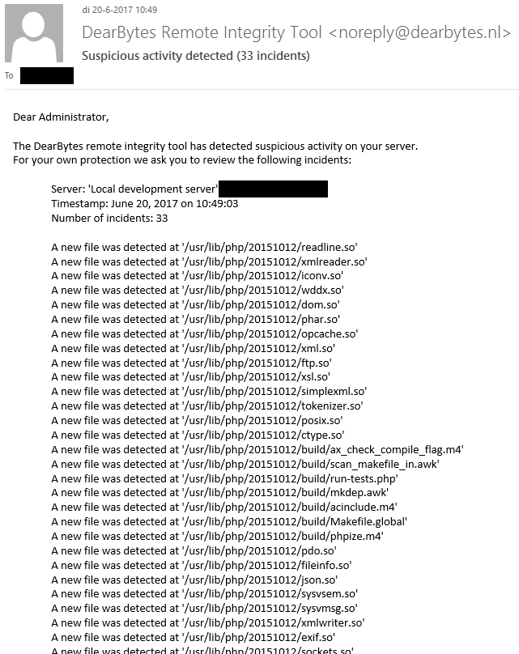

# DearBytes Remote Integrity Tool
The DearBytes remote integrity tool is an [IDS (Intrusion Detection System)](https://en.wikipedia.org/wiki/Intrusion_detection_system) that keeps track of files on a remote server
and logs an event if a file gets added, removed or modified.

## Dependencies
* **Python version**: 3.6.0+

## Installation
To install the tool, clone the source into a directory of choice and run the following commands:

    $ virtualenv venv                 # Set up a virtual environment
    $ source venv/bin/activate        # Activate the virtual environment
    $ pip install -r requirements.txt # Install dependencies

## Usage (Remote Integrity tool)
To use the tool, activate the virtual environment and run the following command:

    $ ./remote-integrity --config {path to config file}.cfg

## Usage (Database Inspection tool)
To use the database inspection tool, activate the virtual environment and run the following command:

    $ ./remote-integrity --list {servers|checksums|events}

## Notification example

## Configuration file format
The tool requires a configuration file to be run, this allows flexibility without having to repeat the same commands every time you use the tool.
The format is as follows:

    # Sample configuration file
    # Usable as template and local development configuration file
    #
    # Copyright (C) 2017 DearBytes B.V. - All Rights Reserved

    [server]
    server_name=Unique name that will be stored in the database
    server_port=22
    server_address=127.0.0.1
    
    [auth]
    auth_username=someone
    auth_private_key=~/.ssh/id_rsa

    [filter]
    scan_php_modules = yes
    start_directory=~/Documents/
    ignore_files=.gitignore
    ignore_directories=.git,fonts
    
    [email]
    email_smtp_host=smtp.domain.com
    email_smtp_user=username
    email_smtp_pass=<password>
    email_recipients=you@email.com,someone@email.com
    email_noreply_address=noreply@example.com
   
    [logging]
    logging_syslog_host=syslog.domain.com
    
    [telegram]
    telegram_api_token={your api token}
    telegram_api_chat_id={your chat id}
    
## Skipping notifications
* **Email notifications:** Leave config field `email_smtp_host` blank
* **Syslog notifications:** Leave config field `logging_syslog_host` blank
* **Telegram notifications:** Leave config field `telegram_api_token` blank
